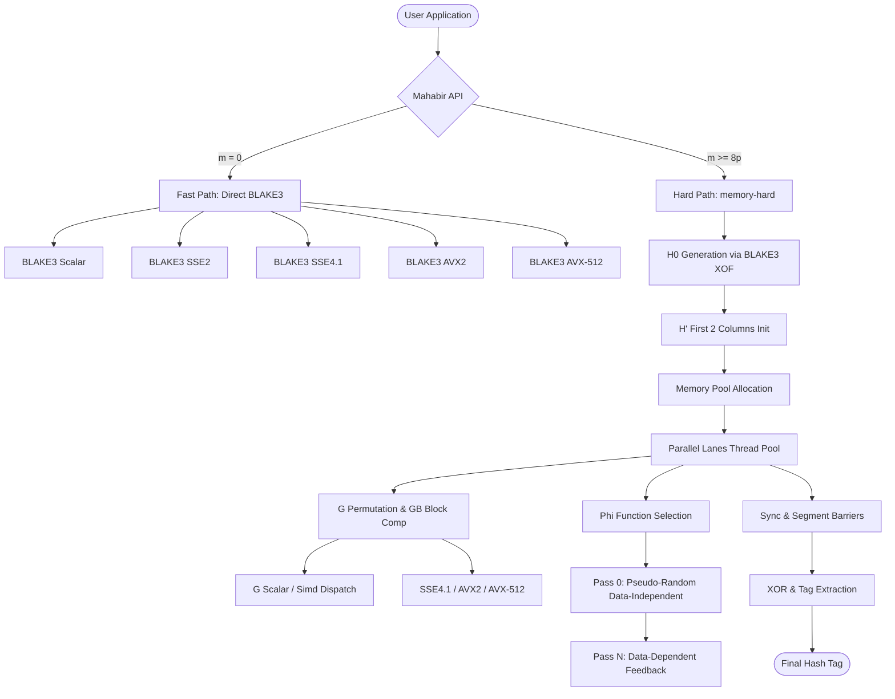

# Mahabir

[](https://opensource.org/licenses/MIT)
[](https://creativecommons.org/publicdomain/zero/1.0/)
[](#multi-architecture-support-status)
[](#multi-architecture-support-status)
[](#multi-architecture-support-status)

> **Mahabir** is a zero-dependency, unified cryptography library written entirely in assembly.
> Fast modes (hash, MAC, KDF, XOF) use BLAKE3. Memory-hard modes (password, KDF) use the
> Argon2id construction with BLAKE3 at its core. x86_64 in active development.
> AArch64 and RISC-V reserved for future implementation.
>
> _This library is named in honor of **Dr. Mahabir Pun**, a distinguished Nepalese teacher, scientist, and social entrepreneur renowned for his pioneering work in introducing wireless technologies to remote mountainous communities and fostering national innovation._

## ⚠️ Development Status

| Component | Status |
|---|---|
| BLAKE3 scalar compression | 🚧 In progress |
| BLAKE3 SIMD (SSE2/4.1/AVX2/AVX-512) | 📋 Planned |
| Mahabir fast modes | 📋 Planned |
| Mahabir hard modes (G, GB, Phi) | 🚧 In progress |
| Thread synchronization | 📋 Planned |
| Test vectors | 📋 Planned |
| Benchmarks | 📋 Planned |

**Not ready for use.** This repository contains architecture and planning documents.

```
                        ┌──────────────────────────────────────┐
                        │        Mahabir Unified API           │
                        │   (hash, keyed, derive, xof, pw, kdf)│
                        └──────────────────┬───────────────────┘
                                           │
                   ┌───────────────────────┴───────────────────────┐
                   │                                               │
       ┌───────────▼───────────┐                       ┌───────────▼───────────┐
       │     FAST PATH         │                       │     HARD PATH         │
       │    (BLAKE3 Modes)     │                       │ (Memory-Hard Argon2id)│
       │                       │                       │                       │
       │ > Standard Hash       │                       │ > H0 Generation (XOF) │
       │ > Keyed Hash (MAC)    │                       │ > Parallel Lanes (p)  │
       │ > Key Derivation (KDF)│                       │ > GB Block Comp & G   │
       │ > Extendable Out (XOF)│                       │ > Non-uniform Map Φ   │
       └───────────────────────┘                       └───────────────────────┘
```

---

## Table of Contents
1. [Development Status](#development-status)
2. [Multi-Architecture Support Status](#multi-architecture-support-status)
3. [Project Architecture](#project-architecture)
4. [Project Layout](#project-layout)
5. [Unified API Reference](#unified-api-reference)
    - [Fast Modes (Standalone BLAKE3)](#fast-modes-standalone-blake3)
    - [Hard Modes (Memory-Hard Argon2id)](#hard-modes-memory-hard-argon2id)
6. [Algorithm & Internal Specifications](#algorithm--internal-specifications)
    - [BLAKE3 Layout & Primitive](#1-blake3-layout--primitive)
    - [Argon2id Memory-Hard Core](#2-argon2id-memory-hard-core)
    - [G Mixing & GB Block Compression](#3-g-mixing--gb-block-compression)
    - [Thread Sync & Segment Barriers](#4-thread-sync--segment-barriers)
    - [Runtime CPU SIMD Dispatching](#5-runtime-cpu-simd-dispatching)
7. [Building & Compiling](#building--compiling)
8. [Verification & Testing](#verification--testing)
9. [Benchmarking](#benchmarking)
10. [Security Considerations](#security-considerations)
11. [Licensing](#licensing)

---

## Multi-Architecture Support Status

Mahabir is designed for efficiency, using CPU-specific assembly:

*   **x86_64 (Active development)**: NASM syntax. Scalar path in progress, SIMD paths planned.
*   **AArch64 (Reserved)**: Planned for future implementation. GNU Assembler (as) syntax. Stubbed build targets trigger helpful errors.
*   **RISC-V (Reserved)**: Planned for future implementation. GNU Assembler (as) syntax. Stubbed build targets trigger helpful errors.

---

## Project Architecture

Mahabir separates its foundation (standalone BLAKE3) from the memory-hard application layers. The top-level system is unified through a single API dispatcher.



---

## Project Layout

```
mahabir/
│
├── Makefile                            # Top-level build orchestrator: builds blake3/ first, then mahabir/
├── README.md                           # Project overview (This file)
├── LICENSE                             # CC0 for specification, MIT for implementation code
│
├── spec/                               # Algorithm specification (Non-code)
│   └── v1.0.md                         # Mahabir spec: parameters, construction, and security analysis
│
├── blake3/                             # STANDALONE BLAKE3 — foundation layer (built first)
│   ├── blake3.asm                      # Top-level entry. Exports: hash, keyed_hash, derive_key, xof
│   ├── Makefile                        # Builds libblake3.a (static) or blake3.so (shared)
│   ├── include/                        # BLAKE3 common macros & layouts
│   │   ├── api.inc                     # Public signatures (C ABI compatible)
│   │   ├── state.inc                   # BLAKE3 state struct: cv, block, chunk_counter, flags, block_len, etc.
│   │   ├── constants.inc               # IV, MSG_SCHEDULE (sigma), ROTR constants {16, 12, 8, 7} for 32-bit
│   │   ├── platform.inc                # Build-time CPU detection macro flags
│   │   └── syscall_linux.inc           # Linux syscall numbers for standalone tests
│   ├── src/                            # BLAKE3 implementations
│   │   ├── x86_64/                     # ACTIVE — Hand-written x86_64 assembly (Scalar, SSE2, SSE4.1, AVX2, AVX-512)
│   │   ├── aarch64/                    # RESERVED — Empty placeholders for Neon support
│   │   └── riscv/                      # RESERVED — Empty placeholders for RVV support
│   ├── test/                           # BLAKE3 test suite
│   │   ├── x86_64/                     # Test drivers for hashing, keyed hashing, KDF, and XOF
│   │   ├── aarch64/                    # RESERVED — Empty
│   │   └── riscv/                      # RESERVED — Empty
│   └── bench/                          # BLAKE3 throughput and cycle benchmarks
│
├── mahabir/                            # MAHABIR PROPER — memory-hard hashing engine
│   ├── mahabir.asm                     # Unified API dispatcher entrypoint
│   ├── Makefile                        # Builds libmahabir.a (links with ../blake3/libblake3.a)
│   ├── include/                        # Mahabir internal configs and layouts
│   │   ├── api.inc                     # API signatures (hash, keyed, derive, xof, password, kdf)
│   │   ├── params.inc                  # Parameter struct offsets & validation macros
│   │   ├── fast.inc / hard.inc         # Fast path vs memory-hard path internal signatures
│   │   ├── blake3.inc                  # Direct BLAKE3 XOF interface wrapper
│   │   ├── g.inc / gb.inc              # G function calling rules and GB row/col matrix mappings
│   │   ├── phi.inc / memory.inc        # Phi reference lookup & Memory Pool offsets
│   │   ├── sync.inc                    # Spinlocks, Futexes, and memory fences
│   │   ├── zeroize.inc                 # Clean wipe macros for memory & registers
│   │   └── platform.inc                # Inherits CPU detection macros from BLAKE3 platform.inc
│   ├── src/                            # Mahabir implementation sources
│   │   ├── x86_64/                     # ACTIVE — NASM implementation
│   │   │   ├── api/                    # Public dispatcher logic, param checks, verify, encoding, and decoding
│   │   │   ├── fast/                   # Fast wrappers mapping API directly to BLAKE3
│   │   │   ├── hard/                   # Core Argon2id assembly engine (G, GB, Phi, Tag, XOR, thread scheduler)
│   │   │   └── dispatch/               # Feature detection table for fast & hard modes
│   │   ├── aarch64/                    # RESERVED — Empty placeholders for future AArch64 implementation
│   │   └── riscv/                      # RESERVED — Empty placeholders for future RISC-V implementation
│   ├── test/                           # Mahabir test drivers
│   │   ├── x86_64/                     # Tests for fast API, hard-H', G, GB, Phi, password hashing, and KDF
│   │   ├── aarch64/                    # RESERVED — Empty
│   │   └── riscv/                      # RESERVED — Empty
│   └── bench/                          # Mahabir latency, throughput, peak RSS, and system benchmarks
```

---

## Unified API Reference

Mahabir provides a unified interface. Fast modes bypass memory allocation pipelines, while Hard modes utilize multi-threaded memory-hard structures.

### Fast Modes (Standalone BLAKE3)
Direct BLAKE3 calls, no memory allocation or thread synchronization.

#### 1. Standard Hashing
```c
void mahabir_hash(const uint8_t *data, size_t len, uint8_t out[32]);
```
*   **Description**: Hashes input data of length `len` using standard BLAKE3 and stores the 32-byte hash in `out`.

#### 2. Keyed Hashing (MAC)
```c
void mahabir_keyed(const uint8_t key[32], const uint8_t *data, size_t len, uint8_t out[32]);
```
*   **Description**: Computes a 256-bit Message Authentication Code (MAC) using the specified 32-byte key.

#### 3. Key Derivation Function (KDF)
```c
void mahabir_derive(const char *context, const uint8_t *material, size_t len, uint8_t out[32]);
```
*   **Description**: Safely derives a high-entropy 32-byte subkey from a context string and input keying material.

#### 4. Extendable Output Function (XOF)
```c
void mahabir_xof(const uint8_t *data, size_t len, uint8_t *out, size_t out_len);
```
*   **Description**: Extendable Output Function. Produces an arbitrary stream of pseudo-random bytes of length `out_len` based on the input.

### Return Codes
Fast modes (hash, keyed, derive, xof) return `void`. Hard modes (password, kdf) return `int` indicating status:

```c
// Return codes
#define MAHABIR_OK          0  // Success
#define MAHABIR_ERR_PARAM   1  // Invalid parameter (e.g., m < 8p, salt < 8 bytes)
#define MAHABIR_ERR_MEMORY  2  // mmap/munmap failure
#define MAHABIR_ERR_THREAD  3  // Thread spawn/join failure
```

### Hard Modes (Memory-Hard Argon2id)
These functions utilize multi-threaded memory-hard constructs to resist offline brute-force and ASIC/FPGA attacks.

#### 5. Password Hashing
```c
int mahabir_password(const uint8_t *pw, size_t pw_len,
                     const uint8_t *salt, size_t salt_len,
                     const uint8_t *pepper, size_t pepper_len,
                     uint32_t p, uint32_t T, uint32_t m, uint32_t t,
                     uint8_t *out);
```
*   **Description**: Generates a secure memory-hard password tag and writes it to `out`.
*   **Returns**: `0` on success, non-zero error code if parameter validation fails.
*   *Note: API parameter order differs from the H0 encoding order for ergonomics (variable-length inputs first).*

#### 6. Key Derivation (Hard KDF)
```c
int mahabir_kdf(const uint8_t *secret, size_t secret_len,
                const uint8_t *salt, size_t salt_len,
                uint32_t p, uint32_t T, uint32_t m, uint32_t t,
                uint8_t *out);
```
*   **Description**: A hard KDF to generate high-entropy keys from secret materials (like master keys) with robust memory-hardness parameters.

---

## Algorithm & Internal Specifications

### 1. BLAKE3 Layout & Primitive
The standalone `blake3/` core utilizes the official state structure layout to compute compression nodes inside a binary tree configuration:

```
+---------------------------------------------------------------------------------+
|                                 BLAKE3 State                                    |
+-------------------+--------------------+-------------------+-------+------------+
|  cv (32 bytes)    |  block (64 bytes)  |  counter (8 bytes)| flags | block_len  |
|  (8 x u32 words)  |  (16 x u32 words)  |  (64-bit index)   | (1 B) | (1 Byte)   |
+-------------------+--------------------+-------------------+-------+------------+
```
*   **Chaining Values (CV)**: Vector paths are initialized using fractional parts of SHA-256 constants (`IV[8]`).
*   **Rotations**: Scaled using ROTR constants `{16, 12, 8, 7}` for 32-bit words.
*   **Extendable Output Function (XOF)**: Operates by feeding the root output block back through the compression cycle with distinct flags and random offsets.

### 2. Argon2id Memory-Hard Core
The hard mode is a hybrid construction incorporating the **Argon2id** design (RFC 9106):
*   **Parameter Limits**: Parallelism $p \le 2^{24}$, tag size $T \ge 4$, memory blocks $m \ge 8p$, iterations $t \ge 1$, salt $8 \le S \le 64$ bytes, pepper $0 \le K \le 64$ bytes.
*   **Default Standard Configuration**: To maximize cryptographic symmetry and physical security, the library standardizes on:
    *   **Salt Size ($S$)**: Exactly **64 bytes** (512 bits) of high-entropy random data.
    *   **Pepper Size ($K$)**: Exactly **64 bytes** (512 bits) per key.
    *   **Hashed Output Tag Size ($T$)**: Exactly **64 bytes** (512 bits) written to the output buffer.
*   **Pepper Pool**: The server maintains a secure, installation-time pool of exactly **64 permanent, independent peppers** ($N = 64$), where each pepper is **exactly 64 bytes**. The 4 KiB pool ($64 \times 64$ bytes) is loaded into the server's private RAM at boot.
*   **Salt-Deterministic Routing**: The salt is generated as a secure, random **64-byte value**. To completely hide the pepper index from database logs or hash strings, the target pepper index is resolved dynamically and automatically from the salt itself:
    $$\text{pepperIndex} = \text{BLAKE3}(\text{salt}) \pmod{64}$$
    In high-performance assembly/C, this is optimized as a bitwise AND:
    $$\text{pepperIndex} = \text{BLAKE3}(\text{salt})[0] \ \text{AND} \ 63$$
    The resulting index selects the specific key from the pool (`PEPPERS[pepper_index]`) to run the hashing and verification logic, distributing user credentials uniformly across all 64 keys for maximum sharded protection.
*   **H0 Hash Block**: Derived by processing little-endian concatenated configuration parameters. Formula:
    $$H_0 = \text{BLAKE3-XOF}(\text{LE32}(p) \mathbin{\Vert} \text{LE32}(T) \mathbin{\Vert} \text{LE32}(m) \mathbin{\Vert} \text{LE32}(t) \mathbin{\Vert} \text{LE32}(0x14) \mathbin{\Vert} \text{LE32}(2) \mathbin{\Vert} \text{LE32}(|P|) \mathbin{\Vert} P \mathbin{\Vert} \text{LE32}(|S|) \mathbin{\Vert} S \mathbin{\Vert} \text{LE32}(|K|) \mathbin{\Vert} K \mathbin{\Vert} \text{LE32}(|X|) \mathbin{\Vert} X)$$
    *Where 0x14 is the Mahabir version (20 decimal) and 2 is the type indicating the Argon2id construction.*
*   **Parameter Mapping**: The associated data parameter $X$ is not exposed in the public API. It is hardcoded as empty with $\text{LE32}(|X|) = \text{LE32}(0) = \text{0x00000000}$. For `mahabir_kdf`, which does not accept a `pepper` parameter, $K$ (pepper) is similarly hardcoded as empty ($\text{LE32}(|K|) = \text{0x00000000}$).
*   **Initial Block Generation**: The first two columns of each lane are derived from $H_0$ via BLAKE3-XOF:
    $$B[i][j] = \text{BLAKE3-XOF}(H_0 \mathbin{\Vert} \text{LE32}(j) \mathbin{\Vert} \text{LE32}(i), 1024)$$
    Where $i$ is the lane index ($0 \le i < p$), and $j \in \{0, 1\}$ is the column index. The output is a 1024-byte block.
*   **Memory Matrix**: Sized in multiples of 1024-byte blocks. Page-aligned to 4096-byte boundaries:
    $$\text{blockOffset} = \text{base} + (\text{lane} \times q + \text{col}) \times 1024$$
*   **Phi Selection ($\Phi$)**:
    *   **Pass 0 (First Half)**: Data-independent reference index computed from a pseudo-random block generated by BLAKE3 XOF on position bounds.
    *   **Pass 0 (Second Half) & Pass N**: Data-dependent. Reference index $J_1 || J_2$ is obtained by parsing the first 64 bits of the previous block ($B[i][j-1]$).
    *   **Mapping Bias**: Computes an intermediate value $x = (J_1 \times J_1) \gg 32$, then scales it to the available reference block count $r$: $y = (x \times r) \gg 32$. The final $y$ is the target block index, skewing references toward recently computed blocks to defeat Time-Memory Trade-Off (TMTO) attacks.

### 3. G Mixing & GB Block Compression
*   **G Permutation**: Unlike BLAKE3's 32-bit logic, the memory-hard $G$ mixing function utilizes **64-bit words** with the LSB32 multiply term from Argon2id (RFC 9106 §3.5). The `2 * LSB32(a) * LSB32(b)` term is the latency-hardening core — it cannot be optimized away by ASIC or GPU attackers.
    *G mixing function pseudocode for 64-bit state words $a, b, c, d$:*
    $$1. \quad a \leftarrow a + b + (2 \cdot (a \bmod 2^{32}) \cdot (b \bmod 2^{32}))$$
    $$2. \quad d \leftarrow \text{ROTR64}(d \oplus a, 32)$$
    $$3. \quad c \leftarrow c + d + (2 \cdot (c \bmod 2^{32}) \cdot (d \bmod 2^{32}))$$
    $$4. \quad b \leftarrow \text{ROTR64}(b \oplus c, 24)$$
    $$5. \quad a \leftarrow a + b + (2 \cdot (a \bmod 2^{32}) \cdot (b \bmod 2^{32}))$$
    $$6. \quad d \leftarrow \text{ROTR64}(d \oplus a, 16)$$
    $$7. \quad c \leftarrow c + d + (2 \cdot (c \bmod 2^{32}) \cdot (d \bmod 2^{32}))$$
    $$8. \quad b \leftarrow \text{ROTR64}(b \oplus c, 63)$$
*   **GB Compression**: The 1024-byte block is an 8×8 matrix of 16-byte registers (128 $u64$ words). $R = X \oplus Y$, then $P$ is applied to each of the 8 rows and each of the 8 columns — 16 $P$-applications total. Each $P$ is one BLAKE2b-style round of 8 $G$ calls, so GB performs 128 $G$ calls. Output = $\text{Result} \oplus R$.

```
     8×8 Matrix of 16-Byte Registers (128 × 64-bit Words)
  +─────────────────────────────────────────────────────────────+
  │ reg0 [w0,w1]  reg1 [w2,w3]  reg2 [w4,w5]  ...  reg7 [w14,w15] │ -> Row 0 (1 P Permutation, 8 G Mixers)
  │ reg8 [w16,w17]                                              │ -> Row 1 (1 P Permutation, 8 G Mixers)
  │ ...                                                         │
  │ reg56 [w112,w113]                                           │ -> Row 7 (1 P Permutation, 8 G Mixers)
  +─────────────────────────────────────────────────────────────+
     │             │             │             │
     ▼             ▼             ▼             ▼ 
   Col 0         Col 1         Col 2         Col 7 (8 Column P Permutations)
```

### 4. Thread Sync & Segment Barriers
*   **Segments**: The column space is divided into 4 identical quadrants.
*   **Lanes**: Run concurrently in parallel threads (assigned up to $p$ lanes).
*   **Sync Points**: Parallel execution is locked with 4 synchronization barriers per iteration pass (Segment 0 $\rightarrow$ 1, 1 $\rightarrow$ 2, 2 $\rightarrow$ 3, and 3 $\rightarrow$ Next Pass).
*   **Primitives**: Thread coordination is achieved via lightweight spinlocks combined with the Linux futex system call (`SYS_futex` on x86_64, number 202) to put idle threads to sleep and prevent high CPU overhead.

### 5. Runtime CPU SIMD Dispatching
At startup, Mahabir queries CPU features (such as CPUID leaf 1 & 7 on `x86_64`) to identify instruction capabilities. The optimal vector implementation is selected dynamically:

#### BLAKE3 CPU Dispatching
| CPU Target | SIMD Optimization | Parallel Compression Instances | Sinks |
| :--- | :--- | :--- | :--- |
| **Scalar** | Fallback baseline | 1 instance | Standard registers |
| **SSE2** | SSE2 vector path | 4 parallel instances | `XMM0`–`XMM7` |
| **SSE4.1** | SSE4.1 + shuffles | 4 parallel instances | `XMM0`–`XMM15` |
| **AVX2** | AVX2 vector path | 8 parallel instances | `YMM0`–`YMM15` |
| **AVX-512** | AVX-512 vector path | 16 parallel instances | `ZMM0`–`ZMM31` |

#### Mahabir G / GB CPU Dispatching
| CPU Target | SIMD Optimization | G / GB Pipeline Capabilities | Sinks |
| :--- | :--- | :--- | :--- |
| **Scalar** | Fallback baseline | 64-bit additions, XORs, ROTR64, scalar 32x32->64 multiply | Standard registers |
| **SSE4.1** | SSE4.1 + `pshufb` | 2 parallel channels, 64-bit shuffles, `pmuludq` multiply | `XMM0`–`XMM15` |
| **AVX2** | AVX2 vector path | 4 parallel channels, wide row scheduling, `vpmuludq` multiply | `YMM0`–`YMM15` |
| **AVX-512** | AVX-512 + `vprorq` | 8 parallel channels, native rotates, `vpmuludq` multiply | `ZMM0`–`ZMM31` |

*Note: SSE2 is omitted for G/GB — its 32-bit lanes cannot perform the 64-bit rotations and 32-bit LSB32 multiply required by Argon2id's G function.*

---

## Building & Compiling

The top-level `Makefile` orchestrates compilation. It will automatically build the standalone BLAKE3 library, build the Mahabir proper engine, link them together, and run testing executables.

### Target Platforms & Prerequisites
*   **Linux**: Primary target. Tested on x86_64.
*   **macOS**: Planned — not yet tested.
*   **Windows**: Experimental — requires MSYS2/MinGW. Not yet tested.
*   **Assembler**: `NASM` (for x86_64) and `GNU binutils` (assembler and linker).
*   **Compilers/Tools**: GNU `make`, `gcc` (for test orchestration and harness setup).

### Standard Build
```bash
# Clone the repository
git clone https://github.com/UtkarshaLab/mahabir.git
cd mahabir

# Build everything (libblake3.a, libmahabir.a, and test executables)
make

# Compile for a specific architecture (triggers stub errors on aarch64/riscv)
make ARCH=x86_64
make ARCH=aarch64
```

---

## Verification & Testing

To run the complete test suite:
```bash
make test
```

### Test Scope
Test vectors will be generated from a Python reference implementation and validated against C2SP specifications. Planned test coverage:
*   **BLAKE3 Standalone Suite**: Hashing, MACs, context key derivation, and seeks.
*   **G & GB Permutation**: Transformations against expected matrices block-by-block.
*   **Phi Function**: Indexing limits, bias constraints, and mapping ranges.
*   **Round-Trip Verification**: Parameter encoding, tag computation, parameter decoding, and verification correctness.
*   **Invalid Param Rejection**: Ensuring boundary limits (thread counts, memory size, salt length) are correctly verified.

---

## Benchmarking

Benchmarks are planned. `make bench` will be enabled once scalar paths are complete.

### Planned Benchmarks
*   **Throughput (Fast)**: Evaluates MiB/sec rates for basic hashes. Shows SIMD scaling efficiency.
*   **Latency (Hard)**: Evaluates exact cycle counts for memory-hard operations.
*   **Memory Footprint**: Verifies actual Peak Resident Set Size (RSS) during execution by parsing `/proc/self/status`.
*   **System Competitors**: Measures performance against native OpenSSL, standard SHA256, and generic `libargon2` implementations.

---

## Security Considerations

> [!CAUTION]
> **Not for production use.** This is a research and educational implementation. It has not undergone formal audit or cryptanalysis. For production password hashing, use libsodium or argon2-rs.

*   **Planned State Zeroization**: Volatile state zeroization using explicit memory barriers and fences (e.g., `mfence`) to wipe state variables, message blocks, and the memory pool matrix clean, preventing compiler elision.
*   **Planned Constant-Time Comparison**: XOR-based lane reduction to evaluate password comparisons in constant time, preventing timing side-channel leaks.
*   **Planned Thread-Safe Initialization**: Thread-safe dispatch table initialization via `compare-and-swap` (atomic operations) on the initialization flag.
*   **Latency Hardening**: The `G` function's `2 * LSB32(a) * LSB32(b)` multiply term is Argon2id's primary ASIC/FPGA defense. XOR and ADD are cheap on custom silicon; dependent 32-bit multiply is not. This term forces attackers to CPU-like clock speeds regardless of parallelism.

---

## Licensing

*   **Specification & Documentation**: Licensed under the **Creative Commons Zero 1.0 Universal License (CC0)** (Public Domain Dedication). Feel free to use the blueprints to build your own implementations.
*   **Code Implementation (including BLAKE3 assembly files)**: All source code files, Makefiles, headers, and test scripts are licensed under the **MIT License**.

See [LICENSE](LICENSE) for details.

---

_UtkarshaLab — Engineering the Foundation of Tomorrow_

